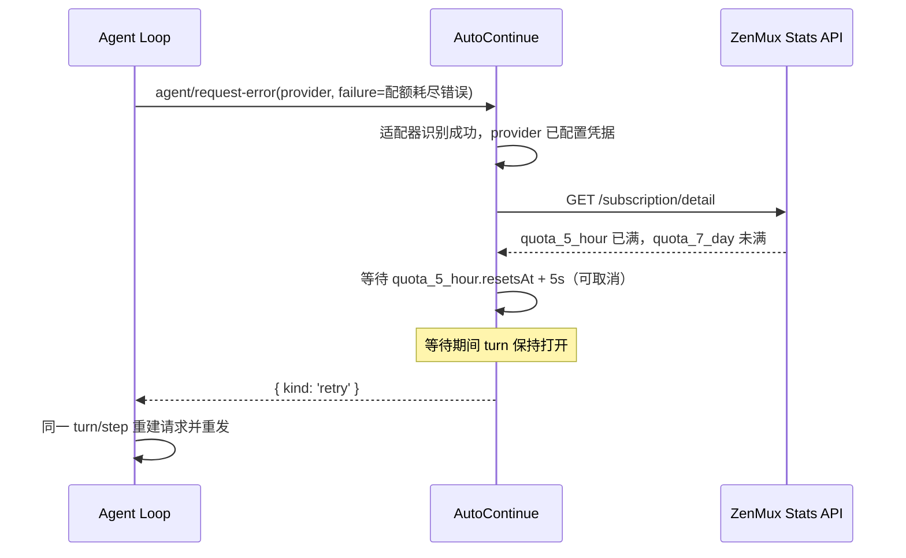
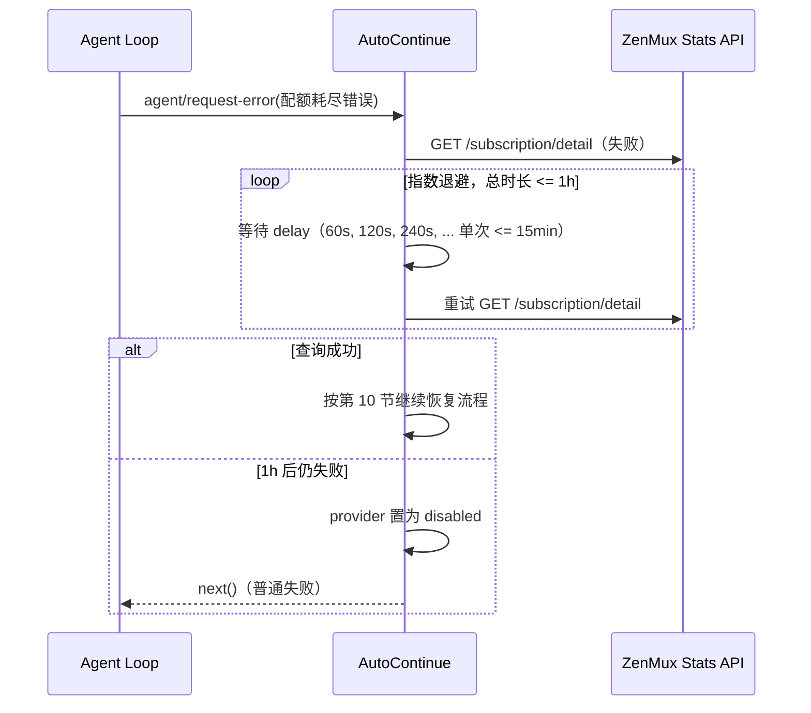
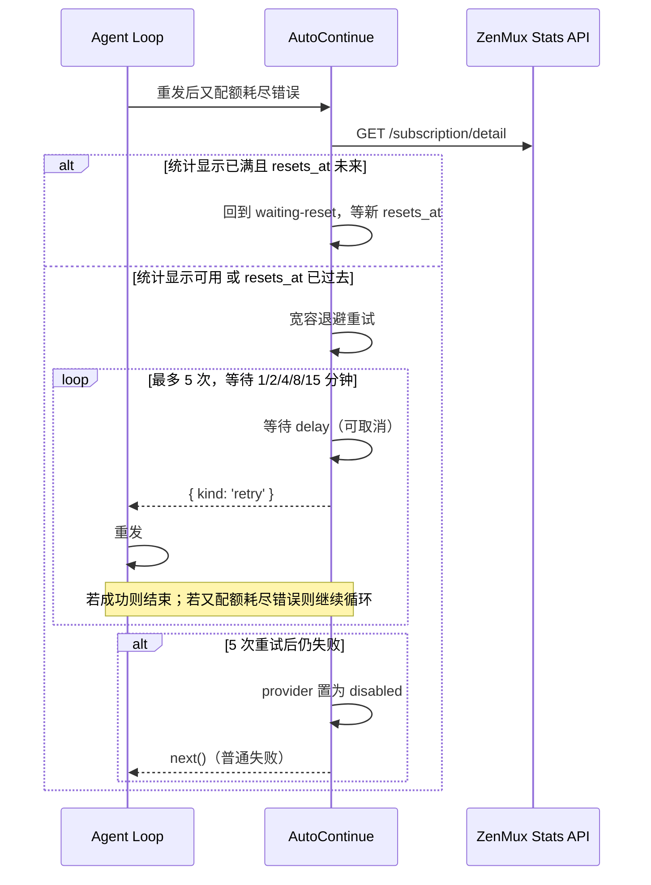

# `@deepseek-ai/dsh-auto-continue` 插件需求文档

> 版本：v1
> 状态：已与需求方确认，进入开发前冻结
> 关联文档：`DSH插件开发背景知识.md`

---

## 1. 背景与问题

### 1.1 问题

当 DeepSeek Harness 中某个 provider 因订阅配额耗尽而返回配额耗尽错误时（不同平台的错误形态不同，v1 中为 ZenMux 的 HTTP 402 `quote_exceeded`），agent loop 默认会把该失败当作普通错误结束 turn。用户希望：

1. 插件识别这类“配额耗尽”错误；
2. 查询该 provider 对应平台的 Platform API 获取配额窗口与重置时间；
3. 在进程内等待配额重置；
4. 等待结束后，让 agent loop **在同一个 turn/step 内**重发最后一次失败的请求，使 LLM 对“发生过失败/等待”无感；
5. 可选地在重发前注入一条 user 角色提示，说明距上次请求已经过了多久。

### 1.2 目标平台

因 LLM 服务提供商众多，首版代码仅对 ZenMux 这一个服务商进行平台适配，以完成初版验证。除特别说明外，下文中出现的“平台”若无特指，均指 ZenMux。

这意味着：**本插件在架构上不是 ZenMux 专用插件**，而是“平台适配器 + 通用恢复状态机”结构。任何能提供配额统计接口的 LLM 服务商，只要按第 8 节实现并注册一个平台适配器，即可复用同一套恢复流程。

- LLM 协议：OpenAI Chat Completion（由 DSH 的 `dsh-llm-pi-ai` 以 `api: openai-completions` 承载）。
- 首版适配平台：ZenMux。
- 首版平台统计接口：`GET https://zenmux.ai/api/v1/management/subscription/detail`。

### 1.3 首版平台（ZenMux）关键事实

- 402 有三种错误类型：
  - `quote_exceeded`：订阅配额耗尽。**本插件只处理这一种。**
  - `insufficient_credit`：账户逾期。不处理。
  - `reject_no_credit`：余额不足。不处理。
- 统计接口返回 `quota_5_hour`、`quota_7_day` 两个滚动窗口：
  - `usage_percentage`：0–1，四位小数；
  - `resets_at`：ISO 8601 字符串或 null；
  - `remaining_flows`：剩余 Flow；
  - `used_flows` / `max_flows` / `used_value_usd` / `max_value_usd`。
- `quota_monthly` 只有上限，没有实时使用量；月限额满时 7 天窗口也满（需求方确认的前提）。
- 统计接口鉴权：`Authorization: Bearer <ZENMUX_MANAGEMENT_API_KEY>`，仅接受 Management API Key。

> **待核对项（不阻塞开工）**：本节所述 402 错误结构（`{"error":{"code":"402","type":"quote_exceeded"}}`）与统计接口响应样例（见 §20.1）目前均来自需求方描述，**尚未用真实 ZenMux 请求/响应核对**。这不阻塞开发：实现可先按 §8、§9 的约定完成。待拿到真实样本后，做一次“黄金样本”回归——用一次真实 402 响应核对 §9.3 的正则，用一次真实统计响应核对 §8.3 的字段映射；发现偏差时以真实样本为准修订 §8/§9（见 §18 验收标准第 8 条）。

---

## 2. 目标与成功标准

### 2.1 功能目标

| 编号 | 目标 |
|---|---|
| G1 | 识别配置过 provider 的配额耗尽错误（v1 为 ZenMux 402 `quote_exceeded`） |
| G2 | 查询平台统计接口，计算需要等待的配额窗口与重置时间 |
| G3 | 在进程内等待配额重置，并在同一 turn/step 内无感重发 |
| G4 | 统计接口失败时按指数退避重试，1 小时后仍失败则放弃并禁用该 provider 的续跑 |
| G5 | 等待重置后重发仍失败时，进入最多 5 次、总等待 30 分钟的宽容退避重试 |
| G6 | 可选注入一条 user 角色提示消息，说明等待时长 |
| G7 | 不修改 DSH 其他包，插件完全独立 |
| G8 | 设计上为未来“配额耗尽后切换 provider”预留空间 |

### 2.2 成功标准

1. 插件以独立包形式安装并启用后，对配置了平台凭据的 provider，其配额耗尽场景（v1 为 ZenMux 402 `quote_exceeded`）可自动等待并续跑。
2. 续跑对模型完全无感：模型历史不包含失败请求或等待本身（除非用户开启 resumeNotice）。
3. 对未配置凭据的 provider、非配额耗尽错误，插件行为与未安装时一致。
4. 所有测试通过，验收标准见第 13 节。

---

## 3. 非目标（v1 明确不做）

- 不跨进程重启恢复。
- 不轮询额度。
- 不预停新请求。
- 不处理余额类/账户逾期类错误（v1 ZenMux 中为 `insufficient_credit` / `reject_no_credit`）。
- 不做 UI 展示。
- 不新增 `system/message` surface 事件，不改 DSH core。
- 不实现 provider 切换（只预留接口与事件）。

---

## 4. 术语表

| 术语 | 解释 |
|---|---|
| provider | `ctx.llm` 中注册的路由名，请求通过 `GenerateOptions.provider` 选择它 |
| Platform | 提供模型服务的平台；v1 仅适配 ZenMux，下文中若无特指均指 ZenMux |
| Platform Key / Management Key | 调用平台 Platform API 所需的管理密钥（ZenMux 为 Management API Key） |
| 统计接口 | 平台提供的配额查询接口；v1 为 ZenMux `GET /api/v1/management/subscription/detail` |
| 配额窗口 | 平台滚动配额窗口；v1 ZenMux 为 5 小时窗口（`quota_5_hour`）与 7 天窗口（`quota_7_day`） |
| 耗尽 | `usage_percentage >= 1` 或 `remaining_flows <= 0` |
| `quote_exceeded` | ZenMux 402 中表示“订阅配额耗尽”的错误类型；其他平台由各自平台适配器识别 |
| 无感重发 | 在同一 turn/step 内由 agent loop 重试，LLM 看不到失败与等待 |
| 统计滞后 | 统计接口数据与实际 API 行为不一致 |
| disabled | 本插件对该 provider 在本次进程生命周期内不再自动续跑 |
| resumeNotice | 可选的重发前 user 角色提示消息 |

---

## 5. 总体方案

### 5.1 包信息

| 项 | 值 |
|---|---|
| 仓库路径 | `packages/llm/auto-continue` |
| npm 包名 | `@deepseek-ai/dsh-auto-continue` |
| 插件形态 | `Service` 子类，默认导出 |
| 服务名 | `ctx.quota` |
| 依赖 | `@deepseek-ai/cordis`（peer）、`@deepseek-ai/schemastery`（runtime）、`@deepseek-ai/dsh-agent`（type）、`@deepseek-ai/dsh-llm`（type）、`@deepseek-ai/dsh-credentials`（type）、`@deepseek-ai/dsh-launch-environment`（runtime） |
| 集成 | 独立发布，不加入 `dsh-base`；提供示例 overlay |

### 5.2 模块结构

```
packages/llm/auto-continue/
  package.json
  tsconfig.json
  README.md
  src/
    index.ts            # 默认导出 QuotaRuntime；declare module 合并 Context 与 Events
    config.ts           # Config schema 与 provider 配置解析
    state.ts            # ProviderRuntimeState 状态与纯函数
    platform.ts         # PlatformQuotaAdapter 接口
    platforms/
      zenmux.ts         # ZenMux 适配器：错误识别、统计抓取、等待目标计算
    recovery.ts         # 恢复状态机（统计查询、等待、post-reset 重试）
    notice.ts           # resumeNotice 消息构造与追加
  tests/
    platforms/zenmux.spec.ts
    recovery.spec.ts
    integration.spec.ts
```

### 5.3 运行形态

```yaml
- name: '@deepseek-ai/dsh-auto-continue'
  config:
    providers:
      zenmux-provider:
        managementKeyRef: ZENMUX_MANAGEMENT_API_KEY
    resumeNotice:
      enabled: true
      template: "因额度限制，本次请求等待了 {hours} 小时 {minutes} 分钟后重新发送。"
```

---

## 6. 配置设计

### 6.1 完整配置示例

```yaml
- id: auto-continue
  name: '@deepseek-ai/dsh-auto-continue'
  config:
    providers:
      zenmux-provider:                          # 必填键：ctx.llm 的 provider 路由名
        platform: zenmux                        # 可选，v1 默认 zenmux
        managementKeyRef: ZENMUX_MANAGEMENT_API_KEY  # 环境变量名/凭据存储引用
        # managementKey: sk-xxxx                 # 明文（可选，不推荐）
        # platformBaseURL: https://zenmux.ai    # 可选，默认官方地址
    resumeNotice:
      enabled: false
      template: "因额度限制，本次请求等待了 {hours} 小时 {minutes} 分钟后重新发送。"
    statsRetry:
      initialDelayMs: 60000
      maxDelayMs: 900000
      totalTimeoutMs: 3600000
    statsRequestTimeoutMs: 30000
    postResetRetry:
      delaysMs: [60000, 120000, 240000, 480000, 900000]
    resetBufferMs: 5000
```

### 6.2 字段说明

#### 6.2.1 `providers`（必填）

`providers` 是对象，键是 `ctx.llm` 的 provider 路由名。没有出现在这里的 provider，本插件完全不介入。

每个 provider 条目：

| 字段 | 类型 | 默认 | 说明 |
|---|---|---|---|
| `platform` | string | `"zenmux"` | 平台标识。插件按此标识查找已注册的平台适配器；初版仅内置 `zenmux` |
| `managementKeyRef` | string | 无 | 管理密钥引用。通过 `ctx.credentials` 解析；无 credentials 服务时回退到 launch environment |
| `managementKey` | string | 无 | 明文管理密钥。**不推荐**，但支持 |
| `platformBaseURL` | string | `"https://zenmux.ai"` | 平台 API base URL（由平台适配器解释；ZenMux 默认官方地址） |

规则：

- `managementKeyRef` 与 `managementKey` **同时存在**：配置校验失败，插件加载失败（fail loud）。
- 两者**都不存在**：该 provider 为 `unconfigured` 状态，不参与自动续跑。
- `platform` 未在已注册平台适配器中：配置校验失败（v1 仅内置 zenmux）。

#### 6.2.2 `resumeNotice`（可选）

| 字段 | 类型 | 默认 | 说明 |
|---|---|---|---|
| `enabled` | boolean | `false` | 是否在重发前注入 user 角色提示 |
| `template` | string | `"因额度限制，本次请求等待了 {hours} 小时 {minutes} 分钟后重新发送。"` | 提示模板，支持占位符 `{provider}`、`{hours}`、`{minutes}` |

#### 6.2.3 `statsRetry`（可选）

统计接口请求失败时的退避参数：

| 字段 | 类型 | 默认 | 说明 |
|---|---|---|---|
| `initialDelayMs` | number | `60000` | 首次退避等待 60s |
| `maxDelayMs` | number | `900000` | 单次退避上限 15 分钟 |
| `totalTimeoutMs` | number | `3600000` | 统计接口重试总时长上限 1 小时 |

退避序列：60s → 120s → 240s → 480s → 900s → 900s → ...，每次翻倍，单次不超过 `maxDelayMs`；最后一次退避裁剪到 `totalTimeoutMs` 的剩余时间。总时长用尽后仍失败，进入 `disabled`。

#### 6.2.4 `statsRequestTimeoutMs`（可选）

单次统计接口 HTTP 请求的超时时间，默认 `30000`（30s）。

#### 6.2.5 `postResetRetry`（可选）

等待重置后，因统计与实际不一致导致的重试参数：

| 字段 | 类型 | 默认 | 说明 |
|---|---|---|---|
| `delaysMs` | number[] | `[60000, 120000, 240000, 480000, 900000]` | 依次为 1、2、4、8、15 分钟，总等待 30 分钟 |

数组长度即“最多重试次数”（5 次）。数组为空视为 0，即等待后首轮重试失败就放弃。

#### 6.2.6 `resetBufferMs`（可选）

在 `resets_at` 基础上额外等待的缓冲时间，默认 `5000`（5s），用于规避窗口切换的边界竞态。

---

## 7. 服务接口与事件

### 7.1 `ctx.quota` 服务

```ts
declare module '@deepseek-ai/cordis' {
  interface Context {
    quota: QuotaRuntime
  }
}

class QuotaRuntime extends Service {
  constructor(ctx: Context, config: Config) {
    super(ctx, 'quota')
    // 注册内置平台适配器（v1 为 zenmux）
    // 注册 agent/request-error 恢复监听器
  }

  /** 获取一个 provider 的当前状态快照。 */
  status(provider: string): QuotaProviderState

  /** 该 provider 是否已放弃自动续跑。 */
  isDisabled(provider: string): boolean

  /** 注册一个平台适配器（未来扩展）。 */
  registerPlatformAdapter(adapter: PlatformQuotaAdapter): () => void
}
```

### 7.2 事件

```ts
declare module '@deepseek-ai/cordis' {
  interface Events {
    /** provider 配额/恢复状态发生变化时广播。 */
    'quota/changed'(provider: string, state: QuotaProviderState): void
  }
}
```

未来“切换 provider”策略可监听 `quota/changed`，并在 `agent/request` 瀑布中改写 provider 路由。

### 7.3 状态快照

```ts
type QuotaProviderState =
  | { phase: 'unconfigured' }                        // 未配置 Key
  | { phase: 'idle' }                                // 正常，无进行中的恢复
  | { phase: 'checking-stats' }                      // 正在查询统计接口
  | { phase: 'waiting-reset'; resetAt: number }      // 等待配额重置
  | { phase: 'post-reset-retrying'; attempts: number } // 重置后宽容重试中
  | { phase: 'disabled' }                            // 已放弃自动续跑
```

---

## 8. 平台适配器

### 8.1 接口

```ts
interface PlatformQuotaAdapter {
  readonly platform: string

  /** 判断一个 LlmFailure 是否为本平台的“配额耗尽”错误。 */
  matchesQuotaExhausted(failure: LlmFailure): boolean

  /** 请求平台统计接口，返回归一化快照。 */
  fetchQuota(
    credential: string,
    baseURL: string,
    signal: AbortSignal,
  ): Promise<PlatformQuotaSnapshot>

  /** 根据归一化快照计算等待目标时间戳（epoch ms）；无法计算时返回 null。 */
  resolveWaitTarget(snapshot: PlatformQuotaSnapshot): number | null
}
```

### 8.2 归一化快照

```ts
interface PlatformQuotaSnapshot {
  /** 平台归一化后的配额窗口列表。v1 ZenMux 为 5h、7d 两个窗口。 */
  windows: QuotaWindow[]
}

interface QuotaWindow {
  /** 窗口标识，如 '5h'、'7d'。 */
  name: string
  usagePercentage: number
  remainingFlows: number
  resetsAt: string | null
}
```

### 8.3 ZenMux 适配器

- 请求：`GET {baseURL}/api/v1/management/subscription/detail`
- 请求头：`Authorization: Bearer <credential>`
- 超时：`statsRequestTimeoutMs`
- 成功判定：HTTP 200 且 JSON `success === true`
- 解析映射：
  - `data.quota_5_hour` → 窗口 `{ name: '5h', ... }`
  - `data.quota_7_day` → 窗口 `{ name: '7d', ... }`
  - 窗口内的 `usage_percentage`、`remaining_flows`、`resets_at` 原样映射
- `matchesQuotaExhausted`：按第 9 节 ZenMux 规则识别。
- `resolveWaitTarget`：按第 10 节 ZenMux 规则计算。
- 任何非 200、网络错误、超时、JSON 解析失败、字段缺失或类型错误，均视为统计接口请求失败。

---

## 9. 错误识别

### 9.1 识别职责归属

错误识别是**平台适配器**的职责。恢复监听器不内置任何平台专属规则，只调用 provider 对应平台适配器的 `matchesQuotaExhausted(failure)`。这样新增一个平台，只需要提供新的适配器，不改恢复状态机。

### 9.2 恢复监听器的判定流程

输入：`payload.provider`、`payload.failure`。

1. `payload.provider` 不在 `config.providers` 中 → 不处理，`next()`。
2. 该 provider 没有配置凭据（`managementKeyRef` 与 `managementKey` 都为空）→ 不处理，`next()`。
3. 该 provider 状态为 `disabled` → 不处理，`next()`。
4. 根据 provider 配置的 `platform` 查找平台适配器；找不到 → 不处理，`next()`（正常配置下不会发生，配置校验阶段会拦截）。
5. 调用 `adapter.matchesQuotaExhausted(payload.failure)`：
   - `false` → 不处理，`next()`；
   - `true` → 进入恢复流程。

### 9.3 ZenMux 适配器的识别规则（v1）

ZenMux 适配器的 `matchesQuotaExhausted` 实现如下：

1. `failure.message` 长度 > 10000 → `false`。
2. 正则匹配（命中任一即判定为 `quote_exceeded`）：

```ts
const ZENMUX_QUOTE_EXCEEDED_PATTERNS = [
  /quote_exceeded/,
  /subscription\s+quota\s+(?:limit|exhausted)/i,
  /reached\s+your\s+subscription\s+quota\s+limit/i,
]

function matchesQuotaExhausted(failure: LlmFailure): boolean {
  // 辅助信号：当 status 存在且不是 402 时，不处理
  if (failure.status !== undefined && failure.status !== 402) return false
  // 主判定：正则白名单
  if (ZENMUX_QUOTE_EXCEEDED_PATTERNS.some(p => p.test(failure.message))) return true
  // JSON 形式：{"error":{"code":"402","type":"quote_exceeded"}}
  if (/\"code\"\s*:\s*\"402\"/.test(failure.message)
      && /\"type\"\s*:\s*\"quote_exceeded\"/.test(failure.message)) {
    return true
  }
  return false
}
```

3. 未命中 → `false`。

> 识别输入形态说明（重要）：
>
> - `failure.message` 的形态取决于适配器边界：`dsh-llm-pi-ai` 上游会把错误压平（取 `error.message` 或 `JSON.stringify`，并丢弃 `cause` 链），因此 `message` 可能是**人类可读文本**，也可能是**一段 JSON 字符串**（形如 `{"error":{"code":"402","type":"quote_exceeded",...}}`，含转义引号）。识别逻辑必须同时覆盖这两种形态。
> - 第 1 条 `/quote_exceeded/` 刻意**区分大小写**（类型标识为蛇形小写）；第 2、3 条带 `i` 忽略大小写，用于匹配人类可读文案。
> - JSON 形式的两条正则要求 message 内是“双引号 + 转义引号”的原始 JSON 文本；若上游压平后丢失该形态，由第 1 条 `quote_exceeded` 兜底。**最终以真实样本核对为准**（见 §1.3 待核对项），样本出现偏差时优先调整此处正则。

### 9.4 设计理由

- `dsh-llm-pi-ai` 当前错误码映射对 ZenMux 402 不完整（`quote_exceeded` 可能未映射为 `QUOTA`），所以本插件不依赖 `failure.code`。
- `dsh-llm-pi-ai` 可能把 `insufficient_credit` 映射为 `QUOTA`，所以本插件也不能只认 `failure.code === 'QUOTA'`。
- v1 的正则白名单刻意收窄到 ZenMux `quote_exceeded` 专属措辞，避免误处理余额类 402；其他平台由各自适配器定义自己的识别规则。

---

## 10. 配额窗口判定

> 本节的“等待目标计算”是 v1 ZenMux 适配器 `resolveWaitTarget` 的实现规则。其他平台适配器可实现自己的规则。

### 10.1 窗口耗尽判定

`usage_percentage` 与 `remaining_flows` 之间是**或**关系：任一条件满足即判定为“耗尽”，**不要求两者同时满足**。

```ts
function isExhausted(window: QuotaWindow): boolean {
  return window.usagePercentage >= 1 || window.remainingFlows <= 0
}
```

- `usage_percentage >= 1`：用量达到或超过 100%。数值按原样比较，**不做 `[0,1]` 夹取**；平台若异常返回 `> 1`（超过 100%）仍按耗尽处理。
- `remaining_flows <= 0`：剩余 Flow 为 0 或负数（含恰好为 0）。
- 两字段可能只命中其一（例如统计滞后时 `usage_percentage` 尚未满而 `remaining_flows` 已为 0，或反之），**任一命中即耗尽**，这正是“或”关系的含义。

### 10.2 等待目标计算（v1 ZenMux 规则）

输入：ZenMux 适配器返回的归一化快照（两个窗口：`5h`、`7d`）。

| 7d 窗口状态 | 5h 窗口状态 | 等待目标 |
|---|---|---|
| 未耗尽 | 已耗尽 | `5h` 窗口的 `resetsAt` |
| 未耗尽 | 未耗尽（统计滞后） | `5h` 窗口的 `resetsAt` |
| 已耗尽 | 已耗尽 | `max(5h.resetsAt, 7d.resetsAt)` |
| 已耗尽 | 未耗尽（理论不应出现，保守处理） | `7d` 窗口的 `resetsAt` |

### 10.3 缺失处理

- 所需窗口对象为 null，或所需 `resetsAt` 为 null/缺失：**关键信息缺失**，当前请求 `next()` 正常失败，不等待。
- `max(a, b)` 中某一方为 null：使用另一方；两方都为 null：`next()` 正常失败。

### 10.4 时间解析

- `resetsAt` 使用 `Date.parse` 解析；解析失败视为缺失。
- 等待目标时间戳 = `resetsAtMs + resetBufferMs`。
- 若计算出的等待目标早于当前时间（`resetsAt` 已过去）：不进入 `waiting-reset`，直接进入“统计与实际不一致”的 post-reset 宽容重试路径。

---

## 11. 恢复状态机

### 11.1 状态图

```mermaid
stateDiagram-v2
  [*] --> idle
  idle --> checking-stats : 配额耗尽错误识别成功
  checking-stats --> waiting-reset : 统计显示耗尽且 resetAt 未来
  checking-stats --> post-reset-retrying : 统计显示未耗尽或 resetAt 已过去
  checking-stats --> disabled : 统计请求失败且 1h 退避耗尽
  waiting-reset --> idle : 重发成功
  waiting-reset --> checking-stats : 重发又配额耗尽错误
  post-reset-retrying --> idle : 重发成功
  post-reset-retrying --> disabled : 5 次重试耗尽
  post-reset-retrying --> checking-stats : 重试又配额耗尽错误
  disabled --> [*]
```

### 11.2 状态说明

| 状态 | 说明 |
|---|---|
| `unconfigured` | 该 provider 未配置平台凭据，本插件不介入 |
| `idle` | 无进行中的恢复 |
| `checking-stats` | 正在查询统计接口（或按退避等待后重查） |
| `waiting-reset` | 统计确认耗尽且 `resetAt` 在未来，等待中 |
| `post-reset-retrying` | 统计与实际不一致，宽容退避重试中 |
| `disabled` | 已放弃，本次进程生命周期内不再自动续跑 |

### 11.3 共享状态与并发

- 每个 provider 在内存中维护一份 `ProviderRuntimeState`。
- 同一 provider 的统计接口查询必须**单飞**：多个并发配额耗尽错误只触发一次查询，其余调用方等待同一结果。
- 不同调用方（不同 session / 不同 turn）的**等待定时器互相独立**，可各自被自己的 `payload.signal` 取消。
- `disabled` 状态全局共享：一旦置位，所有该 provider 的后续配额耗尽错误直接 `next()`。

---

## 12. 关键流程

### 12.1 首次配额耗尽错误且统计显示 7d 未耗尽



### 12.2 首次配额耗尽错误且统计显示 7d 已耗尽

等待目标 = `max(5h.resetsAt, 7d.resetsAt)` + 5s。其余同 12.1。

### 12.3 首次配额耗尽错误且统计显示两窗口都未耗尽

场景：实际请求已经返回配额耗尽错误，但统计接口显示 5h 与 7d 两个窗口都未耗尽。这属于**统计滞后**：实际配额控制面与统计展示面之间存在延迟。

处理原则：**以实际返回的配额耗尽错误为准**，不因统计显示未耗尽而直接重发，否则很可能再次撞上 402。计算等待目标时，按“5h 窗口”处理：

1. 等待目标 = `5h` 窗口的 `resetsAt`。
2. 若 `resetsAt` 为 null/缺失：关键信息缺失，当前请求 `next()` 正常失败，不等待。
3. 若 `resetsAt` 在**未来**：等待至 `resetsAt + resetBufferMs`，然后返回 `{kind:'retry'}`，由 agent loop 在同一 turn/step 内重发。
4. 若 `resetsAt` 已经**过去**：说明统计窗口与实际的偏差较大，不进入长等待，直接转入 12.5 的 post-reset 宽容退避重试路径。

重发后如果再次收到配额耗尽错误，则按 12.5 继续处理。

### 12.4 统计接口请求失败



退避参数：

- 初始 `initialDelayMs` = 60s；
- 每次翻倍；
- 单次上限 `maxDelayMs` = 900s；
- 总时长上限 `totalTimeoutMs` = 3600s；
- 最后一次退避裁剪到剩余时间。

### 12.5 等待重置后重发失败（post-reset retry）

触发条件：从 `waiting-reset` 返回 `{kind:'retry'}` 后，重发请求再次收到配额耗尽错误（v1 为 ZenMux 402 `quote_exceeded`），且查询统计接口后出现以下任一情况：

- 统计显示“配额已满但 `resets_at` 已过去”（统计与实际存在误差）；
- 统计显示“配额可用”（实际接口尚未更新）。

处理：



### 12.6 取消与卸载

- 所有等待（统计退避、waiting-reset、post-reset 退避）必须监听：
  - `payload.signal`：当前 turn 的中止信号；
  - 插件 lifetime `AbortController`：插件卸载信号。
- 任一信号触发：停止等待，不再返回 `{kind:'retry'}`；如果 loop 已中止，由 loop 自身处理。
- 插件卸载时：取消 lifetime signal，清理所有 timer，等待进行中的统计查询随其自身的超时/取消结束。
- 取消不会改变共享的 provider 状态（不会因此置 disabled）。

---

## 13. resumeNotice（可选重发提示）

### 13.1 触发条件

- `resumeNotice.enabled === true`；
- 且本次返回 `{kind:'retry'}` 之前，经历过 `waiting-reset`（含 12.3 的统计滞后等待）；
- 每次配额恢复 episode 只追加一次；post-reset 退避重试阶段不重复追加。

> **“配额恢复 episode”的精确定义**（与 §11 状态机一一对应）：从 provider 状态由 `idle` 进入 `checking-stats`（某次 `agent/request-error` 被识别为配额耗尽并开始恢复）起，到该 provider 状态回到 `idle`（重发成功）或进入 `disabled`（放弃）止，为**一次** episode。
>
> - 一次 episode 内，只在**首次**从 `waiting-reset`（含 12.3 的统计滞后等待）返回 `{kind:'retry'}` 之前追加一次 notice。
> - 同一次 episode 内，若后续落入 `post-reset-retrying` 并再次返回 `{kind:'retry'}`，**不再追加**。
> - 下一次新的 episode（重新从 `idle` 识别进入恢复）再次满足触发条件时，可再次追加。

### 13.2 消息构造

```ts
import { randomUUID } from 'node:crypto'

const message = {
  id: randomUUID(),            // 作为 MessageId 使用
  role: 'user',
  content: [{
    type: 'text',
    text: renderTemplate(config.resumeNotice.template, {
      provider: payload.provider,
      hours,
      minutes,
    }),
  }],
  source: {
    kind: 'plugin',
    plugin: 'auto-continue',
    form: 'notice',
    summary: 'quota auto-continue',
  },
}
```

- `hours`、`minutes`：从“开始等待的时间戳”到“即将返回 retry 的时间戳”计算，分钟向下取整，小时向下取整。
- 模板默认值：`"因额度限制，本次请求等待了 {hours} 小时 {minutes} 分钟后重新发送。"`
- 不支持 system role（v1 不修改 core，只使用 user role）。

### 13.3 追加方式

```ts
payload.agent.session.append('user/message', message, { surfaceOp: 'append' })
```

追加后，agent loop 在同一 turn/step 的下一次重试中会通过 `session.deriveMessages()` 看到这条消息。

---

## 14. 与 `dsh-llm-retry` 的编排

- 两个插件都监听 `agent/request-error`。
- 本插件：
  - 对**识别成功**的配额耗尽错误：不调用 `next()`，直接返回 `{kind:'retry'}` 或 `undefined`，短路下游；
  - 对其他错误：调用 `next()`，交给 `dsh-llm-retry` 等下游策略。
- 因此无论注册顺序如何，行为都正确：
  - 若本插件先注册：本插件短路 quota 错误，其他错误传给下游；
  - 若本插件后注册：`dsh-llm-retry` 对 quota 错误通常调用 `next()`（其 normal 模式不含 QUOTA），本插件接住；对 transient 错误 `dsh-llm-retry` 已处理，本插件不会看到。

---

## 15. 可观测性

### 15.1 日志

使用 `ctx.logger`，按级别记录：

| 级别 | 内容 |
|---|---|
| info | 识别到配额耗尽错误；开始统计查询；统计查询成功；开始等待重置（含等待目标时间）；返回 retry；provider 置为 disabled |
| warn | 统计接口请求失败；统计退避耗尽；`resets_at` 缺失/解析失败；post-reset 重试耗尽；resumeNotice 追加失败 |
| debug | 统计接口原始响应（脱敏后） |

### 15.2 事件

- `quota/changed`：provider 状态相位变化时广播。
- 不新增 session 事件类型。

---

## 16. 边界与限制

1. **进程内**：进程重启后，未完成的等待不会恢复。
2. **open turn**：等待期间 session 存在 open turn；`ctx.sessions.fork` 会被 `OPEN_TURN` 拒绝；进程若崩溃，该 session 的日志中保留未闭合 turn。
3. **新消息排队**：等待期间用户新消息停留在 inbox，等待结束后继续处理。
4. **文本识别盲区**：若 provider 错误文本不在其平台适配器的识别规则内（例如 ZenMux 改写文案），本插件不会触发续跑。
5. **统计接口结构漂移**：字段缺失或类型变化按“关键信息缺失”处理，请求正常失败。
6. **多 session 同 provider**：每个 session 各自等待；统计查询单飞；`disabled` 全局共享。
7. **时区/时钟**：等待目标基于本机时钟解析 ISO 时间；等待使用可取消定时器。
8. **长时间等待**：5h/7d 在 Node `setTimeout` 范围内，但实现采用分段等待策略，降低长定时器与时钟漂移风险。

---

## 17. 测试计划

### 17.1 单元测试

| 模块 | 用例 |
|---|---|
| ZenMux 适配器·错误识别 | `quote_exceeded` JSON 命中；纯文本命中；pi-ai 压平后形态命中（`JSON.stringify` 转义文本 / 人类可读文案两种）；`insufficient_credit` 不命中；`reject_no_credit` 不命中；`rate_limit` 不命中；`failure.status=403` 不命中；长度 >10000 不命中 |
| ZenMux 适配器·等待目标 | 5h 满/7d 未满 → 5h resetsAt；7d 满 → max(5h,7d)；两窗口未满 → 5h resetsAt；`resetsAt` null → 缺失；`remaining_flows=0` 且 `usage_percentage<1` → 耗尽；`usage_percentage=1` 且 `remaining_flows>0` → 耗尽 |
| statsRetry 计算 | 60s 初始；翻倍；单次 900s 封顶；总 1h 封顶与最后裁剪 |
| postResetRetry | 延迟序列 `[1,2,4,8,15]` 分钟；总时长 30 分钟 |

### 17.2 集成测试（fake timers + mock HTTP server）

| 场景 | 预期 |
|---|---|
| ZenMux 402 `quote_exceeded` + 统计 7d 未满 | 等待 5h resetsAt + buffer 后返回 retry，请求成功 |
| ZenMux 402 `quote_exceeded` + 统计 7d 满 | 等待 max(5h,7d) + buffer 后返回 retry |
| ZenMux 402 `quote_exceeded` + 统计两窗口未满 | 等待 5h resetsAt（若 resetsAt 已过去则进入 post-reset 退避） |
| 统计接口连续失败 | 按 60/120/240/480/900... 退避，1h 后 disabled，`next()` |
| 统计接口先失败后成功 | 退避后恢复，继续正常恢复流程 |
| `resets_at` 缺失 | `next()` 普通失败 |
| 等待后重发又 ZenMux 402 `quote_exceeded` + 统计可用 | 进入 post-reset 退避 1/2/4/8/15 分钟，5 次后 disabled |
| 等待后重发又 ZenMux 402 `quote_exceeded` + 统计已满且 resetsAt 未来 | 回到 waiting-reset |
| 无平台凭据配置 | 不查询统计、不等待，`next()` |
| `insufficient_credit` | 不处理，`next()` |
| resumeNotice 开启 | 返回 retry 前追加一条 user 消息；默认关闭不追加 |
| 与 `dsh-llm-retry` 共存 | 非 quota 错误由 llm-retry 处理；quota 错误由本插件处理 |
| 取消 | turn signal 取消后停止等待，不返回 retry |

### 17.3 测试环境

- 使用 vitest fake timers 控制时间。
- Mock ZenMux 统计接口使用本地 HTTP server 或注入的 fetch mock。
- 不访问真实 ZenMux API。

---

## 18. 验收标准

1. 第 17 节所有测试通过。
2. 插件包可独立构建、发布，`dsh plugin add` / `--patch` 可启用。
3. 除本包外，不修改 DSH 仓库任何其他包源码。
4. 配置字段均有 schema 校验与默认值；非法配置 fail loud。
5. 所有等待可取消；插件卸载后无残留 timer / 进行中的自动续跑任务。
6. `quota/changed` 事件按状态变化发布。
7. README 说明配置方式、示例 overlay、限制与未来扩展点。
8. 用一次真实 ZenMux 402 响应与一次真实统计接口响应做“黄金样本”核对，验证 §9.3 正则与 §8.3 字段映射一致；**样本到位前不阻塞开发，样本到位后必须通过**（见 §1.3 待核对项）。

---

## 19. 未来扩展预留

1. **Provider 切换**：
   - `quota/changed` 已发布 provider 状态；
   - 未来策略插件可监听 `quota/changed`，并在 `agent/request` 瀑布中把 provider 路由改为备用 provider。
   - 本插件不实现切换逻辑。
2. **新平台适配器**：
   - `registerPlatformAdapter` 接口已预留；
   - 新增平台只需实现 `PlatformQuotaAdapter`（`matchesQuotaExhausted` / `fetchQuota` / `resolveWaitTarget`）并注册，不改恢复状态机。
3. **系统消息升级**：
   - 若未来 DSH core 支持 `system/message` surface 事件，resumeNotice 可从 user 角色切换为 system 角色。

---

## 20. 附录：ZenMux 统计接口与错误参考

### 20.1 统计接口

```http
GET https://zenmux.ai/api/v1/management/subscription/detail
Authorization: Bearer <ZENMUX_MANAGEMENT_API_KEY>
```

成功响应（节选）：

```json
{
  "success": true,
  "data": {
    "plan": { "tier": "ultra", "interval": "month", "expires_at": "2026-04-12T08:26:56.000Z" },
    "quota_5_hour": {
      "usage_percentage": 0.0715,
      "resets_at": "2026-03-24T08:35:09.000Z",
      "max_flows": 800,
      "used_flows": 57.2,
      "remaining_flows": 742.8,
      "used_value_usd": 1.88,
      "max_value_usd": 26.27
    },
    "quota_7_day": {
      "usage_percentage": 0.0673,
      "resets_at": "2026-03-26T02:15:05.000Z",
      "max_flows": 6182,
      "used_flows": 416.11,
      "remaining_flows": 5765.89,
      "used_value_usd": 13.66,
      "max_value_usd": 202.99
    },
    "quota_monthly": { "max_flows": 34560, "max_value_usd": 1134.33 }
  }
}
```

### 20.2 402 错误类型

| type | 含义 | 本插件行为 |
|---|---|---|
| `quote_exceeded` | 订阅配额耗尽，可等待滚动窗口重置 | 自动续跑 |
| `insufficient_credit` | 账户逾期，需充值 | 不处理 |
| `reject_no_credit` | 余额不足，需充值 | 不处理 |

### 20.3 决策记录摘要

| 决策点 | 结论 |
|---|---|
| 是否跨进程恢复 | 否，仅进程内无感重发 |
| 是否轮询/预停 | 否，只在配额耗尽错误发生后查询统计接口 |
| 处理范围 | 仅各平台适配器判定的“配额耗尽”错误；v1 为 ZenMux `quote_exceeded` |
| 提示消息角色 | user（v1 不修改 core） |
| 提示消息默认 | 关闭 |
| 平台凭据配置 | `managementKeyRef`（env/凭据存储）+ `managementKey`（明文）双字段 |
| 统计接口失败退避 | 初始 60s，翻倍，单次上限 15min，总上限 1h |
| 两窗口都未耗尽 | 以实际配额耗尽错误为准，等 5h `resets_at` |
| 等待窗口选择 | 7d 未满 → 5h `resets_at`；7d 满 → max(5h,7d) |
| 耗尽判定 | `usage_percentage >= 1` 或 `remaining_flows <= 0` |
| 重置后重试 | 最多 5 次，等待 1/2/4/8/15 分钟，总 30 分钟 |
| disabled 范围 | 本次进程生命周期内，按 provider 维度 |
