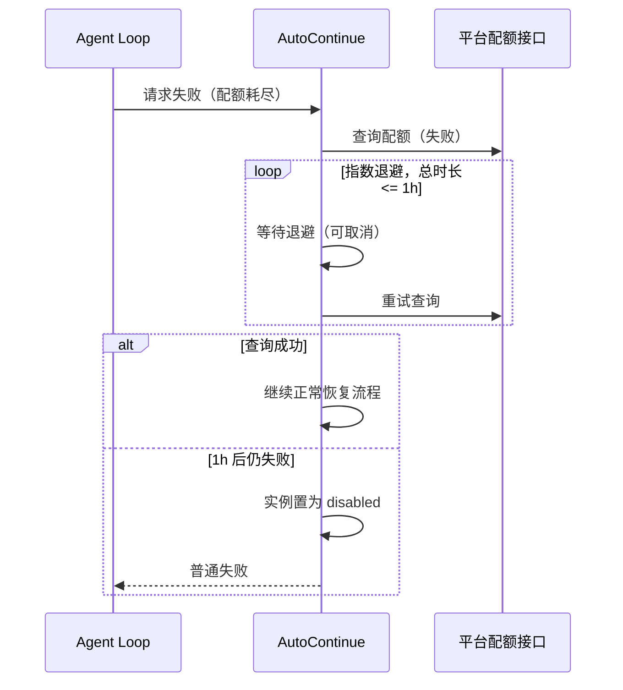
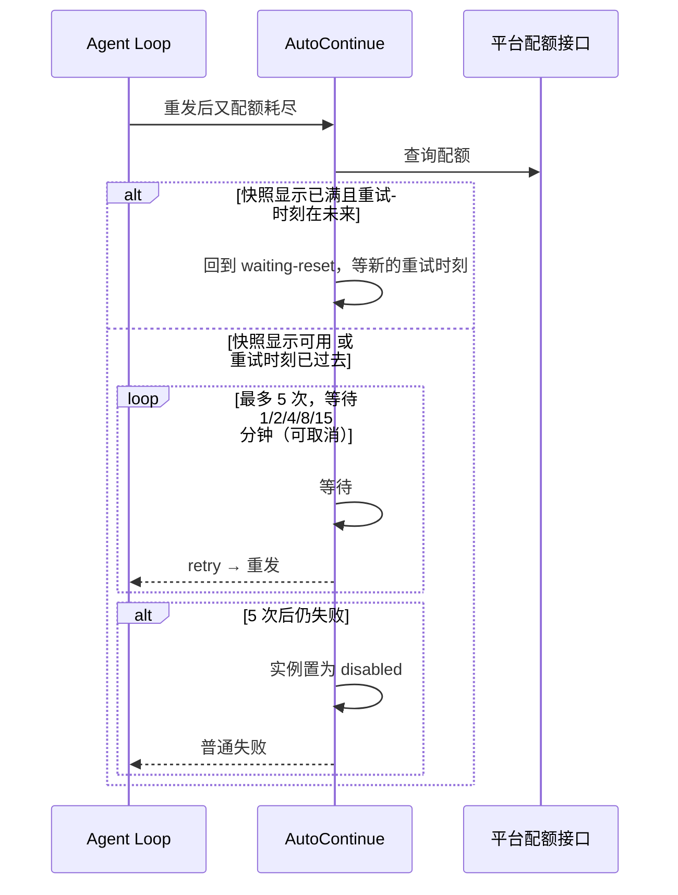

# 恢复流程设计

> 性质：设计文档（描述**当前**流程与参数；取值随版本演进）
> 需求来源：`doc/需求文档/需求文档.md` FR-3 ~ FR-7、NFR-1 ~ NFR-3、NFR-9、NFR-10
> 平台专属部分见 `doc/设计文档/平台适配器设计.md`；设计约束见 `doc/设计文档/平台模板设计约束.md`

---

## 1. 流程总览

配额耗尽错误的完整恢复过程：

```
请求失败
  → 判定链（provider → 实例 → 平台模板）→ 模板认定「配额耗尽」
  → 查询配额接口（可退避重试）
  → 决定「等到什么时候」（或直接进入宽容退避）
  → 可取消地等待
  →（可选）注入一次重发提示
  → 返回 retry，由 agent loop 在同一 turn/step 内重发
  → 重发成功 → 复位；重发又配额耗尽 → 重新决策或宽容退避；重试耗尽 → 放弃
```

**恢复的记账单位是实例**：同一实例下的多个 provider 共享等待与放弃状态，不同实例互不影响。

---

## 2. 状态机

```mermaid
stateDiagram-v2
  [*] --> idle
  idle --> checking-stats : 配额耗尽错误识别成功
  checking-stats --> waiting-reset : 统计显示耗尽且 resetAt 未来
  checking-stats --> post-reset-retrying : 统计显示未耗尽或 resetAt 已过去
  checking-stats --> disabled : 配额接口失败且退避耗尽
  waiting-reset --> idle : 重发成功
  waiting-reset --> checking-stats : 重发又配额耗尽
  post-reset-retrying --> idle : 重发成功
  post-reset-retrying --> disabled : 宽容重试次数耗尽
  post-reset-retrying --> checking-stats : 重试又配额耗尽
  disabled --> [*]
```

| 状态 | 说明 |
|---|---|
| `unconfigured` | 该实例未配置凭据，插件不介入 |
| `idle` | 无进行中的恢复 |
| `checking-stats` | 正在查询配额接口（或按退避等待后重查） |
| `waiting-reset` | 已确认耗尽且重试时刻在未来，等待中 |
| `post-reset-retrying` | 统计与实际不一致，宽容退避重试中 |
| `disabled` | 已放弃，本次进程生命周期内不再自动续跑 |

**episode（一次恢复过程）的定义**：从实例状态由 `idle` 进入 `checking-stats` 起，
到回到 `idle`（重发成功）或进入 `disabled`（放弃）止。episode 级标志（是否已等待过、
是否已注入提示、宽容重试次数）在每次进入新 episode 时重置。

---

## 3. 查询策略

配额接口查询的要求与参数：

- **单飞**：同一实例的并发配额耗尽错误只触发一次查询，其余调用方复用同一结果。
- **首次立即请求**，失败后指数退避：初始 60s，每次翻倍，单次上限 15 分钟，
  总时长上限 1 小时；最后一次退避裁剪到剩余时间。
- **单次请求超时**：固定 30s（不再作为可配置字段）。
- 总时长用尽仍失败 → 实例置为 `disabled`，当前请求按普通失败交回。
- 查询只受插件生命周期信号控制，不被单次 turn 的取消打断（因为查询结果被多个调用方共享）。

---

## 4. 等待决策

由平台模板给出的「可重试时刻」与实例的缓冲时间共同决定：

- 等待目标 = `模板给出的时刻 + 实例的缓冲时间`（默认 5s，用于规避窗口切换的边界竞态）。
- **关键信息缺失**（模板算不出时刻）：不等待，当前请求正常失败。
- 等待目标在**未来**，且满足下列任一条件时进入 `waiting-reset`：
  - 快照判定为「已耗尽」；或
  - 这是本 episode 的**首次**错误（即尚未等待过重置）。
  > 后者用于容忍统计滞后：实际已返回配额耗尽，但统计仍显示未耗尽时，仍按窗口重置时间等待。
- 否则（等待目标已过去，或本 episode 已等待过且快照显示未耗尽）→ 进入 `post-reset-retrying`
  宽容退避。

宽容退避（`post-reset-retrying`）：按固定序列等待 1、2、4、8、15 分钟，共 5 次；每次等待后
返回 retry 由 agent loop 重发。序列长度即最大重试次数；用尽后置为 `disabled`。

---

## 5. 关键流程

### 5.1 首次配额耗尽（7d 未耗尽）

查询接口 → 显示 5h 已满、7d 未满 → 等待 `5h.resetsAt + 缓冲`（可取消）→ 返回 retry，
agent loop 在同一 turn/step 内重发。

### 5.2 首次配额耗尽（7d 已耗尽）

等待目标改为 `max(5h.resetsAt, 7d.resetsAt) + 缓冲`，其余同上。

### 5.3 统计滞后（两窗口都未耗尽）

以**实际返回的配额耗尽错误为准**，不因统计显示未耗尽而直接重发（否则很可能再次撞上限制）：

- 若模板仍能给出未来的重试时刻 → 按 §4 进入 `waiting-reset`；
- 若重试时刻已过去 → 进入 §5.4 的宽容退避。

重发后再次收到配额耗尽错误，按 §5.4 继续处理。

### 5.4 配额接口失败



### 5.5 等待重置后重发又失败（宽容退避）



### 5.6 取消与卸载

- 所有等待都必须同时监听**本轮中止信号**（`payload.signal`）与**插件生命周期信号**。
- 任一信号触发：停止等待，不再返回 retry（本轮已中止时由 agent loop 自行处理）。
- 插件卸载：取消生命周期信号、清理全部定时器；进行中的查询随自身的超时／取消结束。
- **取消不改变共享状态**：不因此把实例置为 `disabled`。

### 5.7 成功复位

收到该实例下 provider 的、非中断的模型回复（`assistant/message` 且来源为模型）时，
实例复位为 `idle` 并清空 episode 标志，使后续配额耗尽可以重新进入恢复流程。

---

## 6. 重发提示（resumeNotice）

- **触发**：提示开启，且本次返回 retry 之前经历过 `waiting-reset`（含统计滞后等待）。
- **频次**：每次 episode 只在**首次**从等待返回 retry 之前注入一次；宽容退避阶段不重复注入；
  新的 episode 可再次注入。
- **内容**：按实例配置的模板渲染，支持 `{provider}`、`{hours}`、`{minutes}`；时长从「开始等待」
  到「即将重发」计算，分钟与小时均向下取整。
- **形态**：以插件来源的 user 角色消息追加到会话的 surface（`surfaceOp: 'append'`），
  使 agent loop 在重发时可见。追加失败只记警告，不影响续跑。
- **角色**：当前使用 user 角色；宿主框架已支持 `system/message`，未来可升级为系统消息
  （需求 §8 预留）。

---

## 7. 与 `dsh-llm-retry` 的编排

两个插件都监听同一个失败事件：

- 本插件：对**识别成功**的配额耗尽错误短路（不调用 `next()`，直接返回 retry 或 undefined）；
- 对其他错误：调用 `next()`，交回下游（如 `dsh-llm-retry`）。

因此无论注册顺序如何行为都正确：本插件先注册时短路自己负责的错误；后注册时下游对配额耗尽
错误通常也会放行，本插件接住。

---

## 8. 可观测性

| 级别 | 内容 |
|---|---|
| info | 识别到配额耗尽；开始查询；查询成功；开始等待（含目标时刻）；返回 retry；实例置为 `disabled` |
| warn | 配额接口请求失败；退避耗尽；重试时刻缺失／解析失败；宽容重试耗尽；提示注入失败 |
| debug | 配额快照（脱敏后） |

事件：实例状态相位变化时广播 `quota/changed`（见 `doc/设计文档/架构与集成设计.md` §3.3）。
不新增会话事件类型。

---

## 9. 已知限制

1. **进程内**：进程重启后未完成的等待不会恢复。
2. **open turn**：等待期间会话处于 open turn，`ctx.sessions.fork` 会被拒绝；进程崩溃时日志中
   保留未闭合的 turn。
3. **新消息排队**：等待期间用户新消息停留在 inbox，等待结束后继续处理。
4. **识别盲区**：若平台改写错误文案导致模板识别失败，不会触发续跑。
5. **配额接口结构漂移**：字段缺失或类型变化按「关键信息缺失」处理，请求正常失败。
6. **多会话同实例**：各自等待；查询单飞；`disabled` 该实例内共享。
7. **时钟**：等待目标基于本机时钟解析 ISO 时间；长等待采用分段等待，降低长定时器与时钟漂移风险。
